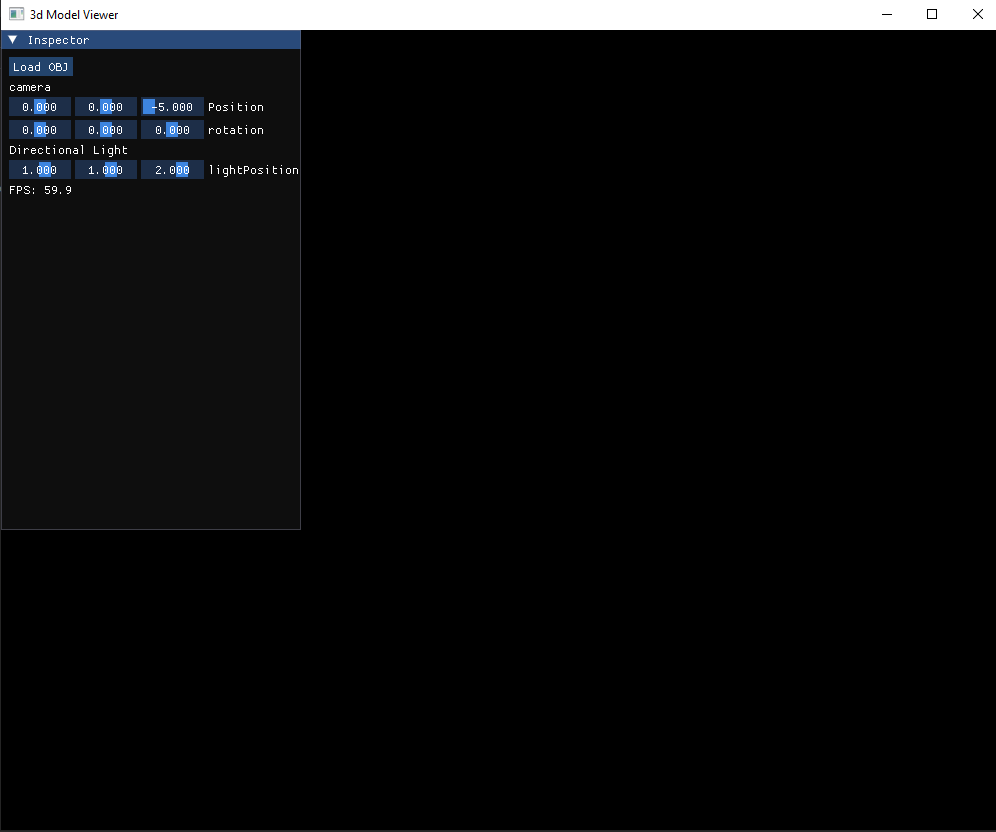
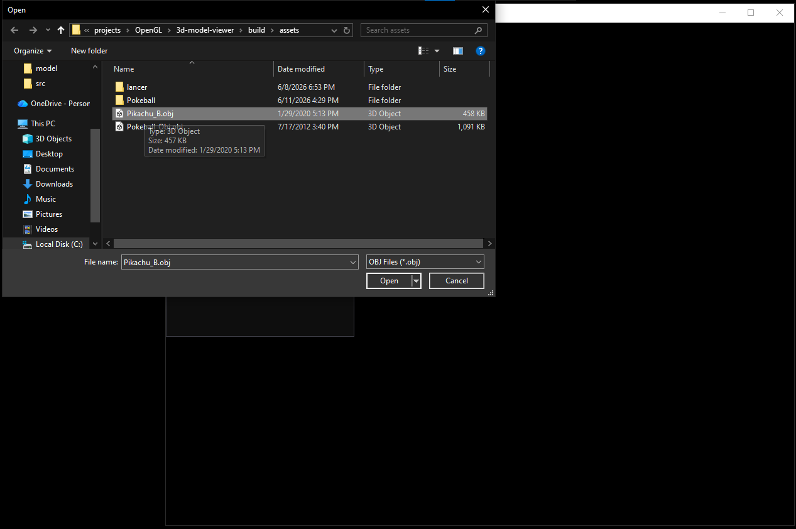
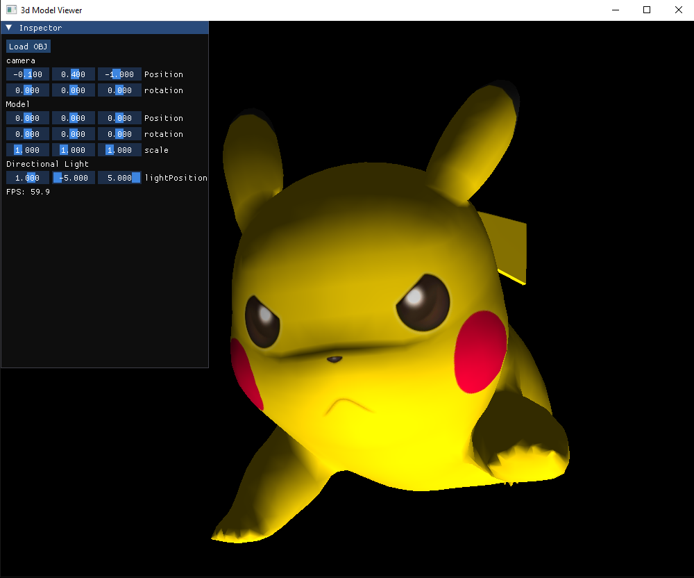

# 3D Model Viewer

A lightweight OpenGL-based 3D Model Viewer built from scratch using C++, GLFW, GLEW, Assimp, and ImGui.

The project allows users to import and inspect 3D models in real time while experimenting with rendering, transformations, camera systems, and lighting.

---

## Features

* Runtime model loading through a file dialog
* OBJ model import using Assimp
* Real-time OpenGL rendering
* Interactive camera controls
* Transform controls for loaded models
* Adjustable lighting
* ImGui-based Inspector panel
* FPS monitoring
* Depth testing support
* Perspective projection

---

## Built With

* C++
* OpenGL 3.3 Core Profile
* GLFW
* GLEW
* Assimp
* Dear ImGui
* STB Image

---

## Screenshot

### Model Viewer



### Loading a Model



### Inspector Panel



## Controls

| Action        | Input                |
| ------------- | -------------------- |
| Move Forward  | Scroll Up            |
| Move Backward | Scroll Down          |
| Move Left     | Left Key             |
| Move Right    | Right Key            |
| Move Up       | Up Key               |
| Move Down     | Down Key             |
| Load Model    | Inspector → Load OBJ |

---

## Building

### Requirements

* MinGW-w64 (g++)
* OpenGL 3.3 compatible GPU

### Build

Compile the project using:

```bash
make
```

The Makefile compiles all source files and produces:

```text
build/app.exe
```

## Running

After building:

```bash
build/app.exe
```

---

## Usage

1. Launch the application.
2. Click **Load OBJ** in the Inspector panel.
3. Select a model from your filesystem.
4. Navigate around the scene using the camera controls.
5. Adjust model transforms and lighting parameters through the UI.

---

## Current Limitations

* cannot look around with mouse pointer
* Primarily tested with OBJ files with single mesh
* Basic lighting model
* No scene graph
* Limited material handling
---

## Future Improvements

* Multiple light types
* PBR rendering
* Texture browser
* Scene hierarchy
* Model statistics panel
* Drag-and-drop model loading
* Gizmo manipulation tools
* Multiple model support

---
